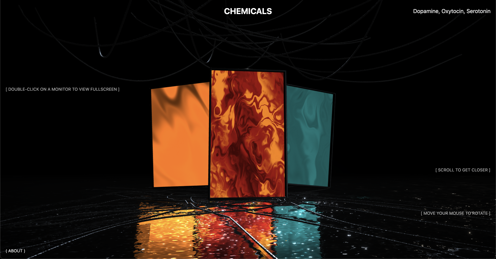

# R3F Chemicals



Real-time visualization of hormones with procedural shaders.

## Getting Started with Next.js

1. **Install dependencies:**

   ```bash
   npm install
   ```

2. **Run the development server:**

   ```bash
   npm run dev
   ```

3. **Build for production:**

   ```bash
   npm run build
   ```

For more details, see the [Next.js documentation](https://nextjs.org/docs).
